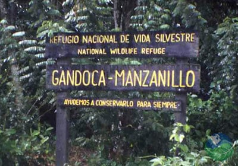
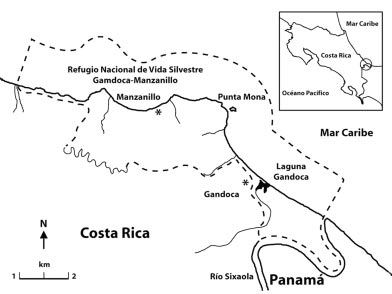

# *Discusión política administrativa por los limites del Refugio de Vida Silvestre Gandoca*

*Elaborado por Luis Vega González*

### Introducción 

El Refugio de Vida Silvestre Gandoca-Manzanillo, ubicado en la costa Caribeña de Costa Rica, enfrenta un complejo conflicto limítrofe que ha desencadenado tensiones entre la conservación ambiental, la expansión urbana, y la corrupción. Desde hace años, se ha denunciado la apropiación ilegal de tierras dentro del refugio, lo que ha resultado en la deforestación de importantes áreas boscosas, esenciales para la preservación de humedales, esteros y manglares.

Este conflicto se agravó con la implementación de un plan regulador costero impulsado por la Municipalidad de Talamanca, que, según las comunidades locales y organizaciones ambientales, beneficia a sectores turísticos y urbanísticos sin consideración de la protección del medio ambiente. El plan ha sido cuestionado por no haber consultado adecuadamente a las comunidades indígenas, y por permitir actividades que alteran el uso de suelo en zonas ecológicamente sensibles.

En respuesta, la Sala Constitucional de Costa Rica ordenó la ampliación del área protegida, pero su implementación ha sido lenta y obstaculizada por intereses económicos y actos de corrupción dentro de las instituciones responsables. Recientemente, varios funcionarios del Sistema Nacional de Áreas de Conservación (SINAC) y la administración local han sido detenidos, acusados de otorgar permisos ilegales para la tala de árboles y favorecer a desarrolladores privados, exacerbando la crisis ambiental y social en la región​

**Figura 1.** Entrada al refugio de vida silvestre Gandoca - Manzanillo

### Historial

El conflicto en el Refugio de Vida Silvestre Gandoca-Manzanillo tiene raíces históricas complejas que reflejan las tensiones entre la conservación ambiental, la expansión económica y los derechos comunitarios. 

###### 1. Origen del Refugio

El Refugio fue creado en 1985 como una medida para proteger una región de alto valor ecológico, que incluye manglares, humedales, arrecifes de coral y una rica biodiversidad. Desde sus inicios, el área ha estado bajo presión debido al desarrollo urbano y turístico, especialmente por su atractiva ubicación en la costa Caribeña.

###### 2. Problemas de apropiación de tierras

A partir de la década de 1990, comenzaron a surgir problemas significativos relacionados con la apropiación ilegal de tierras dentro del refugio. Uno de los casos más notorios fue en [*1992*](https://www.nacion.com/archivo/murio-empresario-turistico-jan-kalina/NXF35YFCNRCVTFBBPG3DFKPEZQ/story/), cuando un empresario intentó construir un hotel dentro del área protegida, generando controversias y demandas legales. Estas apropiaciones ilegales de tierras han continuado a lo largo de los años, exacerbadas por la falta de claridad en los límites del refugio y la corrupción dentro de algunas instituciones locales.

###### 3. Acciones legales, conflictos y tensiones actuales 

En los últimos años, el conflicto ha escalado con la implementación de planes reguladores que defienden los intereses economicos de empresarios y personas con la intención de generar un desarrollo urbano, sin embargo, no se considera la explotación ambiental que esto generaría, y se pone por encima los intereses economicos sobre el valor del recurso natural. La deforestación, impulsada por permisos ilegales otorgados por funcionarios corruptos, ha devastado áreas críticas del refugio. Esto ha provocado una fuerte reacción de organizaciones comunitarias y ambientales, que han denunciado estas actividades y exigido la protección del área.
En 2019, la Sala Constitucional de Costa Rica ordenó la ampliación del área protegida, sumando 188 hectáreas al refugio para tratar de frenar la expansión urbana y turística no regulada. Sin embargo, la implementación de esta medida ha sido obstaculizada por los intereses económicos en la región. En 2024, la situación llegó a un punto crítico cuando varios funcionarios del Sistema Nacional de Áreas de Conservación (SINAC) y de la Municipalidad de Talamanca fueron detenidos por su participación en actividades ilegales que han contribuido a la destrucción del refugio. Este conflicto es un ejemplo de las tensiones entre el desarrollo económico y la conservación ambiental en áreas de alto valor ecológico, donde los derechos de las comunidades locales también juegan un papel crucial.

### Resultados

En 2014, Costa Rica promulgó la [*Ley 9223*](http://www.pgrweb.go.cr/scij/Busqueda/Normativa/Normas/nrm_texto_completo.aspx?param1=NRTC&nValor1=1&nValor2=76957&nValor3=96254&strTipM=TC), una legislación que modificó los límites del Refugio de Vida Silvestre Gandoca-Manzanillo. Esta ley fue objeto de controversia desde su inicio, ya que implicó la reducción de áreas protegidas dentro del refugio, lo que generó preocupación entre las comunidades locales y organizaciones ambientalistas.

La Ley 9223 fue promovida con el argumento de resolver problemas históricos relacionados con la tenencia de tierras y permitir el desarrollo económico de la región. Sin embargo, uno de los efectos más criticados fue la exclusión de ciertas áreas boscosas y otras tierras que previamente habían sido protegidas bajo el estatus de refugio. Esto se interpretó como una concesión a intereses económicos, especialmente aquellos vinculados al desarrollo turístico y urbano en la región de Talamanca, lo que aumentó la presión sobre ecosistemas críticos como los humedales, los manglares y los arrecifes de coral.

A raíz de las protestas y denuncias, en 2019, la Sala Constitucional de Costa Rica ordenó la revisión y ampliación de los límites del refugio, para intentar corregir el daño causado por la reducción previa. La Sala argumentó que era necesario equilibrar el desarrollo socioeconómico con la protección ambiental, y se destacó que la reducción de tierra había puesto en peligro valiosas áreas ecológicas. Esta sentencia reafirmó la importancia de proteger el medio ambiente en zonas de alta biodiversidad, pero también evidenció las tensiones continuas entre conservación y desarrollo en la región​. La ley y sus modificaciones posteriores reflejan los desafíos de la gestión de áreas protegidas en un contexto donde los intereses económicos frecuentemente entran en conflicto con la necesidad de preservar los recursos naturales y los derechos de las comunidades locales.

**Figura 2:** Delimitación del Área de Conservación Silvestre 

### Conclusiones 

 En resumen, la corrupción en el Refugio de Vida Silvestre Gandoca ha tenido un impacto significativo en la gestión y conservación del área. La falta de transparencia y la malversación de fondos destinados a la protección del medio ambiente han debilitado los esfuerzos para preservar la biodiversidad y han afectado negativamente a las comunidades locales que dependen del refugio. Para resolver estos problemas, es crucial implementar medidas más estrictas de rendición de cuentas y fomentar una mayor participación de la comunidad en la gestión del refugio.

### Referencias 

>*Radio 8 de Octubre. (2024, 23 de julio). ¿Quiénes son los detenidos en el caso de la destrucción del bosque del Refugio de Vida Silvestre Gandoca Manzanillo?. Radio 8 de Octubre. https://radio8deoctubre.org/costa-rica-quienes-son-los-detenidos-en-el-caso-de-la-destruccion-del-bosque-del-refugio-de-vida-silvestre-gandoca-manzanillo*

>*Teletica. (2019, 11 de julio). Sala IV ordena modificar los límites de zona protegida Gandoca-Manzanillo. Teletica. https://www.teletica.com/nacional/sala-iv-ordena-modificar-los-limites-de-zona-protegida-gandoca-manzanillo_230685*

>*La Nación. (2023, 18 de junio). Denuncian irregularidades en el Refugio de Vida Silvestre Gandoca. Recuperado de https://www.nacion.com/nacional/denuncian-irregularidades-en-el-refugio-de-vida-silvestre-gandoca/Q7UHD4JKFRB5BHP4CJ5JTHR3C4/story/*

